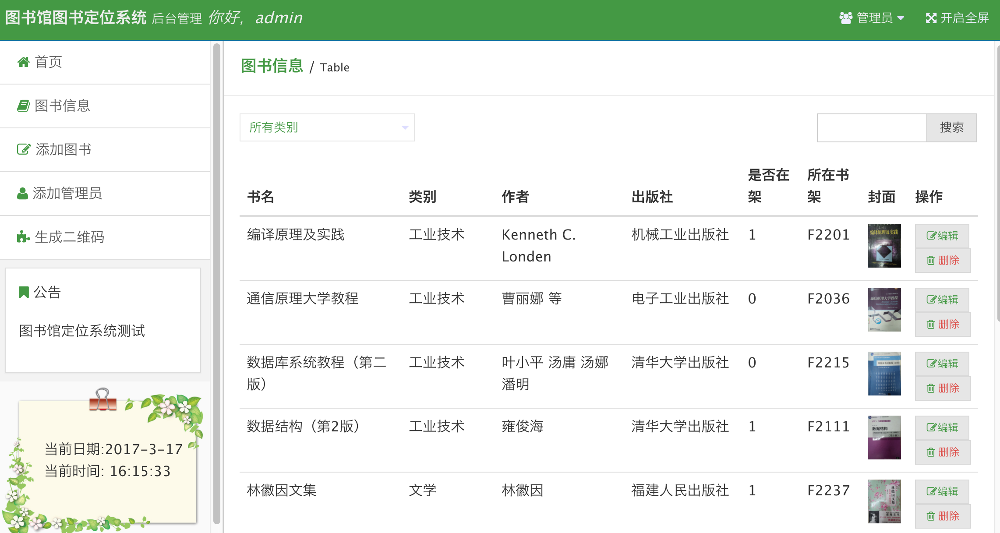

# Library Navigation System

**基于 Android 移动终端和二维码的图书馆导航系统**

本科期间参加"挑战杯"大学生课外学术科技作品竞赛的科技发明制作类作品。利用二维码定位与 3D 室内地图，在智能手机上实现图书馆内低成本、高精度的书籍定位与路线导航。

## 背景

当下的室内导航技术（Wi-Fi、蓝牙、超宽带等）虽在发展，但部署难度大、成本高、定位精度要求高，尚未得到广泛应用。本项目针对大型图书馆的导航需求，利用二维码与 Android 智能手机的结合，根据二维码提供准确的位置信息，实现高效定位以及书籍寻找路线的显示。

## 亮点

- **低成本精确定位** -- 使用二维码记录位置信息，扫描即可定位，无需部署蓝牙/Wi-Fi 等硬件设备
- **3D 室内地图** -- 多维度展示室内结构，精准展示导航路线
- **操作简单** -- 用户在 APP 中扫描二维码，即可在 3D 地图中标出位置并显示到目标书籍的最优路径

## 截图

  


## 项目结构

```
├── android/   Android 客户端 (Java, Android SDK)
├── ios/       iOS 客户端 (Objective-C, CocoaPods)
├── web/       Web 管理后台 (PHP, ThinkPHP)
├── api/       后端 API 服务 (PHP, PhalApi)
└── docs/      项目文档与数据库设计
```

## 各模块说明

### Android 客户端

核心功能：二维码扫描定位、3D 室内地图展示、书籍搜索、路线导航。

### iOS 客户端

与 Android 端功能对齐的 iOS 原生实现。

### Web 管理后台



1. **图书信息管理** -- 查看、编辑、删除、搜索图书（书架位置、借出状态等）
2. **添加图书** -- 附带可拖动缩放的室内地图，辅助编辑图书位置
3. **管理员管理** -- 注册与管理后台账号
4. **个人资料** -- 账号信息与登录记录

### API 服务

基于 [PhalApi](http://www.phalapi.net) (V1.3.4) 构建，为客户端提供图书查询、用户认证等接口服务。
